<div align="center">

# 🎯 Logistic Regression From Scratch


### ✨ *Building Binary Classification from the Ground Up* ✨

<p align="center">
  
  
  
</p>

<p align="center">
  <a href="#-overview">Overview</a> •
  <a href="#-features">Features</a> •
  <a href="#-quick-start">Quick Start</a> •
  <a href="#-mathematical-foundation">Math</a> •
  <a href="#-use-cases">Use Cases</a> •
  <a href="#-acknowledgments">Credits</a>
</p>

---


</div>

## 📚 Overview

<div align="center">

```ascii
╔══════════════════════════════════════════════════════════════╗
║  🚫 No Scikit-Learn  |  ✅ Pure NumPy  |  🧮 From Scratch  ║
╚══════════════════════════════════════════════════════════════╝
```

</div>

This repository contains a **complete implementation of Logistic Regression** built entirely from scratch using Python and NumPy. Perfect for those who want to understand the mathematical foundations and inner workings of one of machine learning's most fundamental algorithms!  🎓

<br>

---

## ✨ Features

<div align="center">

<table>
<tr>
<td align="center" width="33%">

<h3>Pure Implementation</h3>
<p>Built with NumPy only - no ML libraries! </p>
</td>
<td align="center" width="33%">

<h3>Optimization</h3>
<p>Gradient descent from first principles</p>
</td>
<td align="center" width="33%">

<h3>Visualizations</h3>
<p>Beautiful ROC curves & confusion matrices</p>
</td>
</tr>
<tr>
<td align="center" width="33%">

<h3>Metrics</h3>
<p>Accuracy, precision, recall, F1-score</p>
</td>
<td align="center" width="33%">

<h3>Improvements</h3>
<p>Advanced techniques & regularization</p>
</td>
<td align="center" width="33%">

<h3>Documentation</h3>
<p>Interactive Jupyter notebooks</p>
</td>
</tr>
</table>

</div>

<br>

---

## 🗂️ Repository Structure

```
📦 Logistic-Regression-Fron-Scratch
┣ 📂 Main jupyter notebook
┃ ┗ 📓 Core implementation & training
┣ 📂 Improved Model
┃ ┗ 📓 Enhanced versions with optimizations
┣ 📜 . gitignore
┗ 📖 README.md ← You are here!  📍
```

<br>

---

## 🚀 Quick Start

<div align="center">

### 🎬 Get Started in 4 Easy Steps! 

</div>

<table>
<tr>
<td width="25%" align="center">

<h4>Step 1</h4>
<b>Clone Repo</b>
</td>
<td width="25%" align="center">

<h4>Step 2</h4>
<b>Install Packages</b>
</td>
<td width="25%" align="center">

<h4>Step 3</h4>
<b>Launch Jupyter</b>
</td>
<td width="25%" align="center">

<h4>Step 4</h4>
<b>Run & Learn! </b>
</td>
</tr>
</table>

### 💻 Installation Commands

```bash
# 1️⃣ Clone the repository
git clone https://github.com/willow788/Logistic-Regression-Fron-Scratch.git
cd Logistic-Regression-Fron-Scratch

# 2️⃣ Install dependencies
pip install numpy pandas matplotlib seaborn jupyter scikit-learn

# 3️⃣ Launch Jupyter Notebook
jupyter notebook

# 4️⃣ Open and run the notebooks!  🎉
```

<div align="center">

### 📋 Prerequisites


</div>

<br>

---

## 🧮 Mathematical Foundation

<div align="center">

### 🎯 The Sigmoid Function

</div>

```math
σ(z) = \frac{1}{1 + e^{-z}}
```

<div align="center">

**Where:** `z = w₁x₁ + w₂x₂ + ... + wₙxₙ + b`

<br>

| Component | Description |
|:---------:|: ------------|
| **🎲 Sigmoid** | Maps linear output to [0, 1] probability |
| **💰 Cost Function** | Binary Cross-Entropy Loss |
| **⚡ Optimization** | Gradient Descent Algorithm |
| **📉 Learning** | Iterative weight updates |

</div>

<br>

---

## 📊 What You'll Learn

<div align="center">

<table>
<tr>
<td width="50%" valign="top">

### 🎓 **Core Concepts**

```diff
+ Sigmoid activation function
+ Cost function derivation  
+ Gradient computation
+ Parameter optimization
+ Convergence analysis
+ Decision boundaries
```

</td>
<td width="50%" valign="top">

### 🛠️ **Implementation Skills**

```diff
+ Vectorized operations
+ Training loop design
+ Model evaluation
+ Hyperparameter tuning
+ Data preprocessing
+ Performance visualization
```

</td>
</tr>
</table>

</div>

<br>

---

## 📈 Algorithm Pipeline

```mermaid
graph LR
    A[🔧 Initialize<br/>Weights & Bias] --> B[➡️ Forward<br/>Propagation]
    B --> C[💰 Calculate<br/>Cost]
    C --> D[⬅️ Backward<br/>Propagation]
    D --> E[🔄 Update<br/>Parameters]
    E --> F{✅ Converged?}
    F -->|No| B
    F -->|Yes| G[🎯 Make<br/>Predictions]
    
    style A fill:#e1f5ff
    style B fill:#fff4e1
    style C fill:#ffe1e1
    style D fill:#e1ffe1
    style E fill:#f0e1ff
    style F fill:#ffe1f0
    style G fill:#e1ffe1
```

<div align="center">



</div>

<br>

---

## 🎯 Use Cases

<div align="center">

<table>
<tr>
<td align="center" width="25%">

<h3>📧 Spam Detection</h3>
<p>Email classification</p>
</td>
<td align="center" width="25%">

<h3>🏥 Medical Diagnosis</h3>
<p>Disease prediction</p>
</td>
<td align="center" width="25%">

<h3>💳 Fraud Detection</h3>
<p>Transaction security</p>
</td>
<td align="center" width="25%">

<h3>🎬 Sentiment Analysis</h3>
<p>Review categorization</p>
</td>
</tr>
</table>

</div>

<br>

---

## 🔍 Model Improvements

<div align="center">

| Feature | Description | Benefit |
|:-------:|:------------|:--------|
| ⚡ **Regularization (L1/L2)** | Penalty terms added to cost | Prevents overfitting |
| 🎲 **Feature Scaling** | Normalize input features | Faster convergence |
| 🔄 **Mini-batch GD** | Update on data subsets | Improved efficiency |
| 📉 **Learning Rate Schedule** | Adaptive learning rates | Better optimization |
| 🎯 **Cross-Validation** | K-fold validation | Robust evaluation |

</div>

<br>

---

## 🤝 Contributing

<div align="center">

**Contributions, issues, and feature requests are welcome! **


<br><br>

[](https://github.com/willow788/Logistic-Regression-Fron-Scratch/issues)
[](https://github.com/willow788/Logistic-Regression-Fron-Scratch/pulls)

<br>

Give a ⭐ if this project helped you!

</div>

<br>

---

## 📝 License

<div align="center">

This project is **MIT** licensed. 


</div>

<br>

---

## 👤 Author

<div align="center">


### **willow788**

[](https://github.com/willow788)
[](https://github.com/willow788)

</div>

<br>

---

## 🙏 Acknowledgments

<div align="center">

<table>
<tr>
<td align="center" width="33%">

<h3>📚 Learning Resources</h3>
<a href="https://www.geeksforgeeks.org/"></a>
<p><i>Tutorial on Logistic Regression implementation</i></p>
</td>
<td align="center" width="33%">

<h3>📊 Dataset Provider</h3>
<a href="https://www.kaggle.com/"></a>
<p><i>High-quality datasets for training</i></p>
</td>
<td align="center" width="33%">

<h3>🎨 Visualization AI</h3>
<a href="https://github.com/features/copilot"></a>
<p><i>Enhanced confusion matrix & ROC visuals</i></p>
</td>
</tr>
</table>

<br>

### 💡 **Special Thanks**

- **Andrew Ng** - Machine Learning Course inspiration
- **The ML Community** - For continuous learning and support
- **Open Source Contributors** - For making knowledge accessible

</div>

<br>

---

<div align="center">


### 🌟 Made with ❤️ and lots of ☕

 **If you found this helpful, please give it a** ⭐ 

<br>

**Happy Learning! 🚀**

<br>


</div>
